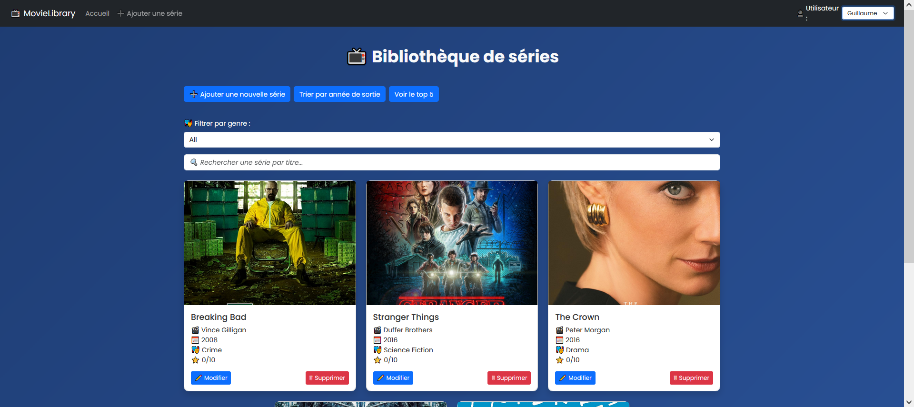
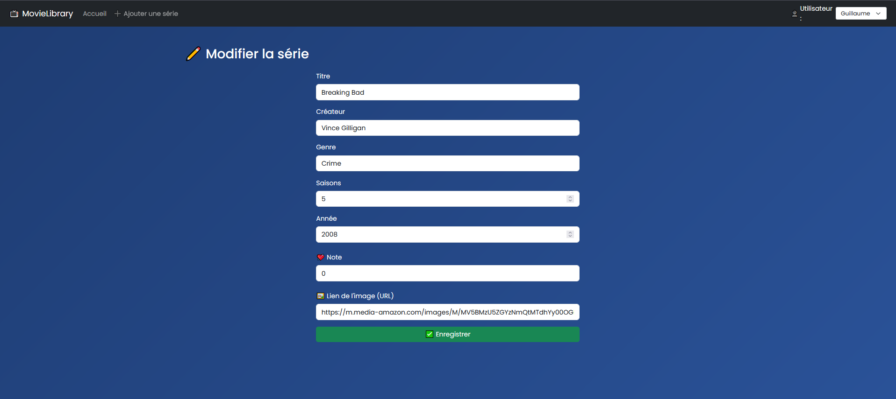

# 🎬 MovieLibrary

Une application fullstack en .NET et Angular permettant de gérer une bibliothèque de séries TV, avec gestion des utilisateurs, filtrage, recherche, tri, et une belle interface moderne. 🌟

## 🛠️ Technologies utilisées

- 🔹 ASP.NET Core (C#)
- 🔹 Entity Framework Core + SQLite
- 🔹 Angular 17
- 🔹 Bootstrap 5
- 🔹 Tailwind (en complément)
- 🔹 Git + GitHub

## ⚙️ Fonctionnalités principales

- 👥 Sélection d’un utilisateur actif (navbar dynamique)
- 📚 CRUD complet sur les séries
- 📂 Filtrage par genre, utilisateur ou année
- 🔎 Recherche par mot-clé
- 📊 Classement top 5 par note
- ✨ Design moderne avec animations
- 🔐 Architecture basée sur les best practices (DTO, services, include...)

## 📸 Captures d’écran

### Interface principale  

### Ajout d’une série  

## 🚀 Lancer le projet en local

### Côté .NET (API)
cd ShowApp
dotnet run

### Côté Angular (Client)
cd show-client
npm install
ng serve
Rendez-vous sur http://localhost:4200

### 📦 Structure du projet
movie-library/
├── ShowApp/          # Back-end .NET + EF Core
├── show-client/      # Front-end Angular
└── movie-library.sln # Fichier de solution

### 💡 Auteur
👤 Guillaume — Développeur Full Stack C# / .NET passionné par l'applicatif
